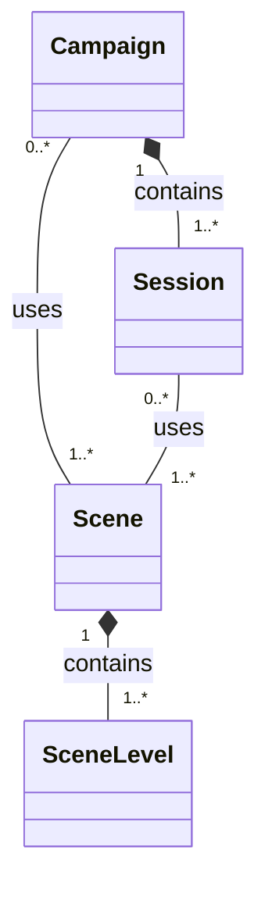

# Core Domain

The Core Domain contains the fundamental, tool-agnostic concepts used to
organize tabletop content.

## Components

- [Campaign](./campaign.md)
- [Session](./session.md)
- [Scene](./scene.md)
- [Scene Level](./scene-level.md)

## Conceptual Model

## Core Idea

A Campaign owns Sessions.

Scenes are reusable content and therefore have an independent lifecycle. A Scene
may be used by multiple Campaigns and Sessions.

A Scene contains one or more Scene Levels.

## Domain Invariants

- User-visible Core definitions have a non-empty display name.
- A Campaign always contains at least one Session.
- A Scene always contains at least one Scene Level.
- A Scene may be reused by multiple Campaigns.
- A Scene may be reused by multiple Sessions.

## Lifecycle Rules

- Creating a Campaign atomically creates its initial Session and a new initial
  Scene, then associates that Scene with the Session. The Scene remains an
  independent reusable definition after creation.
- Creating an additional Session requires an existing Scene and associates it
  with that Session.
- Creating a Scene automatically creates its initial Scene Level.
- Deleting a Scene removes its Scene Levels and Session associations. The
  operation is rejected before mutation if any affected Session would become empty.

## Boundary

The Core Domain must not depend on:

- Audio Mixer;
- Initiative Tracker;
- Encounter Builder;
- game-system-specific mechanics;
- frontend technologies;
- persistence technologies.

Scene Tools may reference these concepts, but not the opposite.

## Open Questions

- Is Scene purely a reusable definition?
- Where should mutable state created while running a Scene be stored?
- Is a Scene occurrence within a Session a distinct domain concept?
