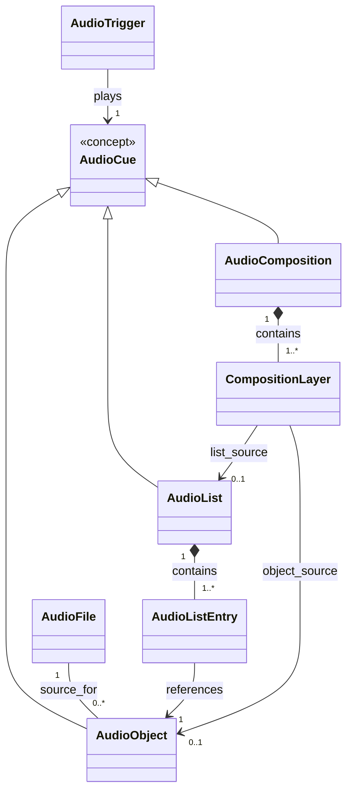

# Audio Mixer

The Audio Mixer is a Scene Tool responsible for reusable audio resources,
selection, composition, and playback triggers.

It depends on the Core Domain but is not part of it.

## Conceptual Overview



## Components

- [Audio File](./audio-file.md)
- [Audio Object](./audio-object.md)
- [Playback Instance](./playback-instance.md)
- [Audio List](./audio-list.md)
- [Audio Composition](./audio-composition.md)
- [Audio Cue](./audio-cue.md)

`Audio List Entry` and `Composition Layer` are currently documented inside
their parent concepts rather than as independent components.

## Core Ideas

- An Audio File represents the underlying audio resource.
- An Audio Object is the smallest directly playable persistent audio concept and defines a reusable playback region, gain, optional loop, and fade behavior.
- A Playback Instance is one transient runtime execution of an Audio Object and is never persisted.
- An Audio List selects or advances through Audio Objects.
- An Audio Composition orchestrates multiple sources over time.
- Audio Mixer concepts may reference Core Domain concepts.
- Core Domain concepts must not depend on the Audio Mixer.

## Core Domain Relationship

An Audio Trigger may be associated with a Scene Level or another supported
owner.

The Audio Mixer owns that relationship.

For example:

```text
Audio Mixer
└── Audio Trigger
        └── references → Scene Level
```

The Scene Level does not store or require Audio Trigger as part of its own
definition.

## Invariants

- Every Audio Object references exactly one Audio File.
- Every Audio List contains at least one Audio List Entry.
- Every Audio List Entry references exactly one Audio Object.
- Every Audio Composition contains at least one Composition Layer.
- Every Composition Layer has exactly one source:
  Audio Object XOR Audio List.

## Current Scope

Nested Audio Compositions are intentionally not part of the initial conceptual
model.

This avoids recursive composition and cycle-detection complexity until a real
use case justifies it.

## Open Questions

- Which scheduling modes are needed for compositions?
- Should Audio Mixer state be configurable per Scene, Scene Level, Campaign, or
  a combination of these?

## Current specification status

The following concepts have an initial specification sufficient for implementation-oriented design:

- `Audio Object`
- `Playback Instance`
- `Audio Cue`
- `Audio List`
- `Audio Composition`
- `Audio Composition Instance`
- global `Audio Mixer`

`Audio Trigger` is not part of the initial architecture.

Application events, UI handlers, and runtime components call the global `AudioMixer` directly when they need to execute an `AudioCue`.

A future binding abstraction should only be introduced if event-to-audio associations become user-configurable and persistent.
- [Scene Audio Configuration](./scene-audio-configuration.md) — persistent Audio Cues and Audio Compositions available in a Scene.
- [Scene Level Audio Configuration](./scene-level-audio-configuration.md) — persistent per-level Composition layer overrides.
- [Scene Audio Runtime](./scene-audio-runtime.md) — transient Scene-specific audio state and Scene Level reconciliation.
- [Audio Object Editor UX](../../frontend/audio-object-editor.md) — interactive waveform editor and preview workflow.
