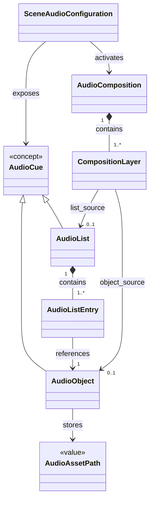

# Audio Mixer

The Audio Mixer is a Scene Tool responsible for reusable audio resources,
selection, composition, and playback triggers.

It depends on the Core Domain but is not part of it.

## Conceptual Overview

## Components

- [Audio Asset Reference](./audio-file.md)
- [Audio Object](./audio-object.md)
- [Playback Instance](./playback-instance.md)
- [Audio List](./audio-list.md)
- [Audio Composition](./audio-composition.md)
- [Audio Cue](./audio-cue.md)

`Audio List Entry` and `Composition Layer` are currently documented inside
their parent concepts rather than as independent components.

## Core Ideas

- An audio asset is discovered transiently below the configured root; an Audio
  Object persists only its relative path.
- An Audio Object is the smallest directly playable persistent audio concept and defines a reusable playback region, gain, optional loop, and fade behavior.
- A Playback Instance is one transient runtime execution of an Audio Object and is never persisted.
- An Audio List selects or advances through Audio Objects.
- An Audio Composition orchestrates multiple sources over time.
- Audio Mixer concepts may reference Core Domain concepts.
- Core Domain concepts must not depend on the Audio Mixer.

## Core Domain Relationship

Audio Mixer configuration may reference a Core `Scene` or `SceneLevel`, while
Core remains unaware of audio. `SceneAudioConfiguration` exposes reusable cues
and compositions in a Scene. `SceneLevelAudioConfiguration` stores only layer
state overrides owned by the Audio Mixer.

## Invariants

- Every Audio Object stores exactly one normalized relative asset path.
- Every Audio List contains at least one Audio List Entry.
- Every Audio List Entry references exactly one Audio Object.
- Every Audio Composition contains at least one Composition Layer.
- Every Composition Layer has exactly one source:
  Audio Object XOR Audio List.

## Current Scope

Nested Audio Compositions are intentionally not part of the initial conceptual
model.

This avoids recursive composition and cycle-detection complexity until a real
use case justifies it.

## Current specification status

The following concepts have an initial specification sufficient for implementation-oriented design:

- `Audio Object`
- `Playback Instance`
- `Audio Cue`
- `Audio List`
- `Audio Composition`
- `Audio Composition Instance`
- context-owned `Audio Mixer`

Persistent definitions have stable UUID identities and user-facing names. Those
fields are required to reference and manage reusable definitions even when a
conceptual diagram focuses only on playback behavior.

`Audio Trigger` is not part of the initial architecture.

Application events, UI handlers, and runtime components call their context's
`AudioMixer` directly when they need to execute an `AudioCue`.

A future binding abstraction should only be introduced if event-to-audio associations become user-configurable and persistent.

- [Scene Audio Configuration](./scene-audio-configuration.md) — persistent Audio Cues and Audio Compositions available in a Scene.
- [Scene Level Audio Configuration](./scene-level-audio-configuration.md) — persistent per-level Composition layer overrides.
- [Scene Audio Runtime](./scene-audio-runtime.md) — transient Scene-specific audio state and Scene Level reconciliation.
- [Audio Object Editor UX](../../frontend/audio-object-editor.md) — interactive waveform editor and preview workflow.
