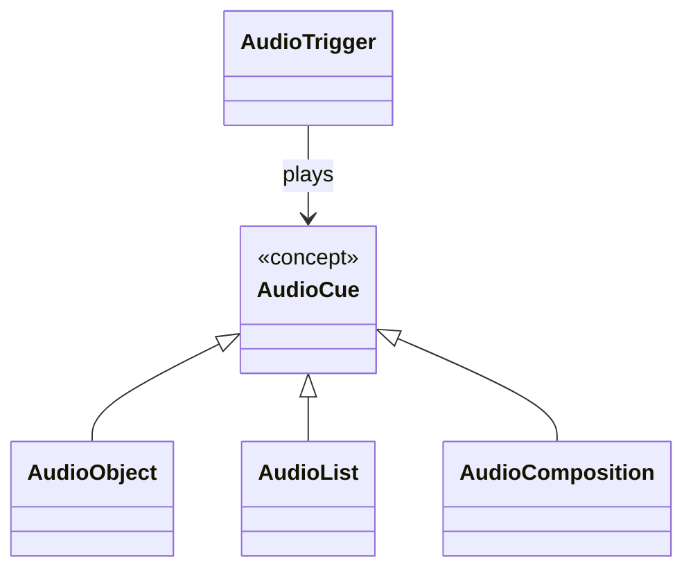

# Audio Cue

## Purpose

Audio Cue is a conceptual abstraction for anything that can be directly played
by an Audio Trigger.

Current Audio Cue types are:

- [Audio Object](./audio-object.md)
- [Audio List](./audio-list.md)
- [Audio Composition](./audio-composition.md)

## Conceptual Relationship

## Important Constraint

Audio Cue is currently a domain abstraction only.

It does not require:

- an `AudioCue` database table;
- an `AudioCue` Rust struct;
- inheritance;
- a specific enum;
- a trait;
- a frontend union type;
- a particular persistence strategy.

Those are later implementation decisions.

## Purpose of the Abstraction

The abstraction allows the Audio Mixer to state a simple rule:

> An Audio Trigger plays exactly one Audio Cue.

without forcing the conceptual model to treat Audio Object, Audio List, and
Audio Composition as unrelated targets.

## Architectural Boundary

Audio Cue belongs entirely to the Audio Mixer tool.

## Related Components

- [Audio Object](./audio-object.md)
- [Audio List](./audio-list.md)
- [Audio Composition](./audio-composition.md)
- [Audio Trigger](./audio-trigger.md)

## Open Questions

- What implementation representation best preserves this abstraction?
- Should future playable concepts also satisfy the Audio Cue role?
